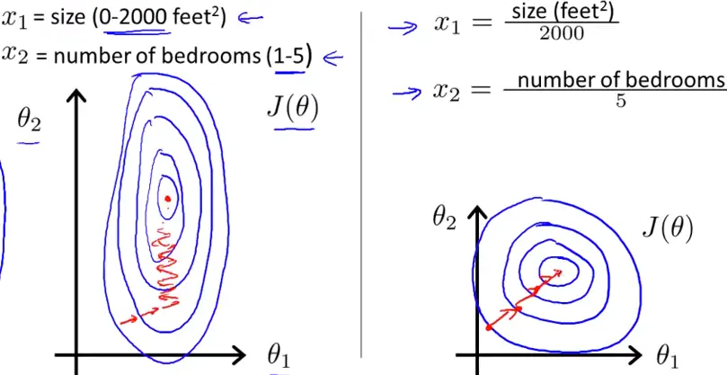
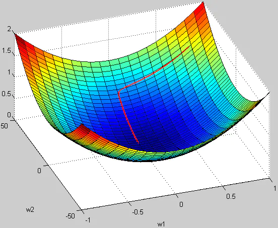

# 归一化和标准化

## 为什么要归一化和标准化

归一化/标准化实质是一种线性变换，线性变换有很多良好的性质，这些性质决定了对数据改变后不会造成“失效”，反而能提高数据的表现，这些性质是归一化/标准化的前提。比如有一个很重要的性质：线性变换不会改变原始数据的数值排序。

（1）某些模型求解需要
    
1. 在使用梯度下降的方法求解最优化问题时， 归一化/标准化后可以加快梯度下降的求解速度，即提升模型的收敛速度。如左图所示，未归一化/标准化时形成的等高线偏椭圆，迭代时很有可能走“之”字型路线（垂直长轴），从而导致迭代很多次才能收敛。而如右图对两个特征进行了归一化，对应的等高线就会变圆，在梯度下降进行求解时能较快的收敛。
      
      
    
2. 一些分类器需要计算样本之间的距离(如欧氏距离)，例如KNN。如果一个特征值域范围非常大，那么距离计算就主要取决于这个特征，从而与实际情况相悖(比如这时实际情况是值域范围小的特征更重要)。

（2）无量纲化
例如房子数量和收入，因为从业务层知道，这两者的重要性一样，所以把它们全部归一化。 这是从业务层面上作的处理。

（3）避免数值问题
太大的数会引发数值问题。

## 哪些模型必须归一化/标准化？

（1）SVM
不同的模型对特征的分布假设是不一样的。比如SVM 用高斯核的时候，所有维度共用一个方差，这不就假设特征分布是圆的么，输入椭圆的就坑了人家，所以简单的归一化都还不够好，来杯白化才有劲。比如用树的时候就是各个维度各算各的切分点，没所谓。

（2）KNN
需要度量距离的模型，一般在特征值差距较大时，都会进行归一化/标准化。不然会出现“大数吃小数”。

（3）神经网络

1）数值问题
归一化/标准化可以避免一些不必要的数值问题。输入变量的数量级未致于会引起数值问题吧，但其实要引起也并不是那么困难。因为tansig（tanh）的非线性区间大约在[-1.7，1.7]。意味着要使神经元有效，tansig( w1x1 + w2x2 +b) 里的 w1x1 +w2x2 +b 数量级应该在 1 （1.7所在的数量级）左右。这时输入较大，就意味着权值必须较小，一个较大，一个较小，两者相乘，就引起数值问题了。
假如你的输入是421，你也许认为，这并不是一个太大的数，但因为有效权值大概会在1/421左右，例如0.00243，那么，在matlab里输入 421·0.00243 == 0.421·2.43，会发现不相等，这就是一个数值问题。

2）求解需要

a. 初始化：在初始化时我们希望每个神经元初始化成有效的状态，tansig函数在[-1.7, 1.7]范围内有较好的非线性，所以我们希望函数的输入和神经元的初始化都能在合理的范围内使得每个神经元在初始时是有效的。（如果权值初始化在[-1,1]且输入没有归一化且过大，会使得神经元饱和）

b. 梯度：以输入-隐层-输出这样的三层BP为例，我们知道对于输入-隐层权值的梯度有2ew(1-a^2)*x的形式（e是誤差，w是隐层到输出层的权重，a是隐层神经元的值，x是输入），若果输出层的数量级很大，会引起e的数量级很大，同理，w为了将隐层（数量级为1）映身到输出层，w也会很大，再加上x也很大的话，从梯度公式可以看出，三者相乘，梯度就非常大了。这时会给梯度的更新带来数值问题。

c. 学习率：由（2）中，知道梯度非常大，学习率就必须非常小，因此，学习率（学习率初始值）的选择需要参考输入的范围，不如直接将数据归一化，这样学习率就不必再根据数据范围作调整。 隐层到输出层的权值梯度可以写成 2ea，而输入层到隐层的权值梯度为 2ew(1-a^2)x ，受 x 和 w 的影响，各个梯度的数量级不相同，因此，它们需要的学习率数量级也就不相同。对w1适合的学习率，可能相对于w2来说会太小，若果使用适合w1的学习率，会导致在w2方向上步进非常慢，会消耗非常多的时间，而使用适合w2的学习率，对w1来说又太大，搜索不到适合w1的解。如果使用固定学习率，而数据没归一化，则后果可想而知。

d.搜索轨迹：已解释

（4）PCA
